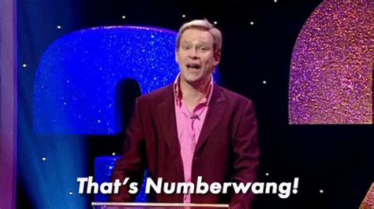

<!-- README.md is generated from README.Rmd. Please edit that file -->

# numberwang 

<!-- badges: start -->


<!-- badges: end -->

`numberwang` will convert floating point numbers (and integers) to their
word representations, and vice versa.

The key differentiator of this package, compared to
[{nombre}](https://cran.r-project.org/package=nombre), is that it
supports decimal representations by listing individual decimal digits.

See below for a comparison with `{nombre}`, `{english}`, `{spanish}` and
`{xfun}`.

## What’s in the box

-   `num_to_words(num, decimals = 3)` converts numeric vectors to
    character vectors
-   `words_to_num(words)` converts character vectors to numeric vectors

## Installation

You can install from
[GitHub](https://github.com/coolbutuseless/numberwang) with:

``` r
# install.package('remotes')
remotes::install_github('coolbutuseless/numberwang')
```

## That’s `numberwang`



``` r
library(numberwang)

c(12, pi, exp(10))
```

    #> [1]    12.000000     3.141593 22026.465795

``` r
num_to_words(c(12, pi, exp(10)))
```

    #> [1] "twelve"                                               
    #> [2] "three point one four two"                             
    #> [3] "twenty-two thousand and twenty-six point four six six"

``` r
words_to_num(c(
  'negative fifteen point seven',
  "twenty-three point seven zero one",
  "ten million, two thousand and forty two"
))
```

    #> [1]      -15.700       23.701 10002042.000

## Limitations

-   Floating point representation isn’t exact, which means that for very
    large numbers or very small numbers, and for lots of numbers
    inbetween, all the digits after the first few must often be taken
    with a grain of salt.
-   E.g.
    `formatC(0.3-0.2, format = 'f', digits = 20) = 0.09999999999999997780`
-   E.g. `1e25` should just be a `1` followed by zeros, but in floating
    point representation we get:
    `formatC(1e25, format = 'f', digits = 0) = 10000000000000000905969664`
-   The `{english}` and `{nombre}` packages will warn you about
    precision loss like this, but `{numberwang}` won’t.

## Feature comparison

|                  | numberwang     | nombre                  | english  | spanish   | xfun     |
|------------------|----------------|-------------------------|----------|-----------|----------|
| function         | num\_to\_words | nom\_card               | english  | to\_words | n2w      |
| working range    | double()       | double()                | +/- 2^90 | \[0,999\] | +/- 1e15 |
| decimals         | Yes            | as fractions            | No       | No        | No       |
| spanish          | No             | No                      | No       | Yes       | No       |
| words-to-numbers | words\_to\_num | nom\_uncard (ints only) | No       | No        | No       |

## Just for fun - Let’s rotate the board!


``` r
exp(300)
```

    #> [1] 1.942426e+130

``` r
formatC(
  exp(300), format = 'f', digits = 0
)
```

    #> [1] "19424263952412558251527551342607068708348876681949259689720520473778975990853476787505520791207218561168735878224980403355291484160"

``` r
num_to_words(exp(300))
```

      nineteen duoquadragintillion, four hundred and twenty-four
      unquadragintillion, two hundred and sixty-three quadragintillion, nine
      hundred and fifty-two novemtrigintillion, four hundred and twelve
      octatrigintillion, five hundred and fifty-eight septentrigintillion,
      two hundred and fifty-one sextrigintillion, five hundred and
      twenty-seven quintrigintillion, five hundred and fifty-one
      quattuortrigintillion, three hundred and forty-two tretrigintillion,
      six hundred and seven duotrigintillion, sixty-eight untrigintillion,
      seven hundred and eight trigintillion, three hundred and forty-eight
      novemvigintillion, eight hundred and seventy-six octavigintillion, six
      hundred and eighty-one septenvigintillion, nine hundred and forty-nine
      sexvigintillion, two hundred and fifty-nine quinvigintillion, six
      hundred and eighty-nine quattuorvigintillion, seven hundred and twenty
      trevigintillion, five hundred and twenty duovigintillion, four hundred
      and seventy-three unvigintillion, seven hundred and seventy-eight
      vigintillion, nine hundred and seventy-five novemdecillion, nine
      hundred and ninety octadecillion, eight hundred and fifty-three
      septendecillion, four hundred and seventy-six sexdecillion, seven
      hundred and eighty-seven quindecillion, five hundred and five
      quattuordecillion, five hundred and twenty tredecillion, seven hundred
      and ninety-one duodecillion, two hundred and seven undecillion, two
      hundred and eighteen decillion, five hundred and sixty-one nonillion,
      one hundred and sixty-eight octillion, seven hundred and thirty-five
      septillion, eight hundred and seventy-eight sextillion, two hundred and
      twenty-four quintillion, nine hundred and eighty quadrillion, four
      hundred and three trillion, three hundred and fifty-five billion, two
      hundred and ninety-one million, four hundred and eighty-four thousand,
      one hundred and sixty

## Related Software

-   [nombre](https://cran.r-project.org/package=nombre)
-   [english](https://cran.r-project.org/package=english)
-   [spanish](https://cran.r-project.org/package=spanish)
-   [xfun](https://cran.r-project.org/package=xfun)

## Acknowledgements

-   R Core for developing and maintaining the language.
-   CRAN maintainers, for patiently shepherding packages onto CRAN and
    maintaining the repository
